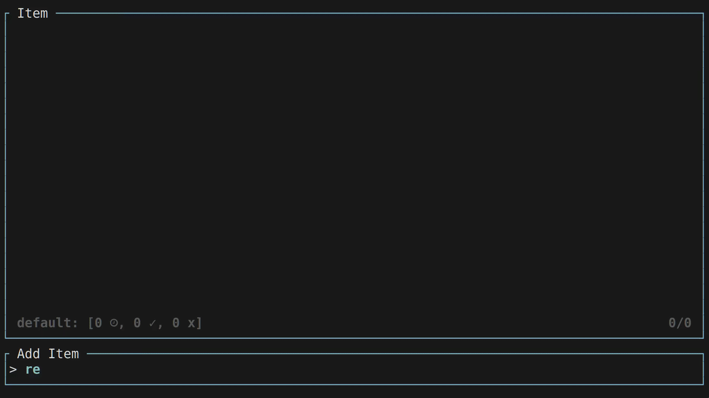

# Todo-rs

> Todo TUI written in Rust

## Demo



## Features

- [x] Text-based user interface
- [x] create, edit, and remove todo item
- [x] display countdown until deadline
- [x] multiple workspace support
- [x] display number of in progress, late, and completed item

## Usage

Item Display:
- `w`: add workspace
- `-`: display workspace
- `a`: add item
- `e`: edit item
- `d`: remove item
- `y`: toggle item
- `j`: scroll down
- `k`: scroll up
- `q` or `Ctrl + c`: quit the program
- `?`: toggle help display

Add Item:
- `Ctrl + d`: toggle expire date prompt
- `Enter`: accept input
- `Escape`: exit prompt

Workspace Display:
- `Enter`: select workspace
- `e`: edit workspace
- `d`: remove workspace
- `j`: scroll down
- `k`: scroll up

Add Workspace:
- `Enter`: accept input
- `Escape`: exit prompt

## Timestamp Format

There are 3 different available format which are:

- `year-month-date hour:minute:second` (***####-##-## ##:##:##***)
- `hour:minute:second` (***##:##:##***)
- `year-month-date` (***####-##-##***)

## Building

Clone the repository:

``` sh
$ git clone https://github.com/Z5483/todo-rs.git
```

To compile and install, run the following:

``` sh
$ make install
```

The default install prefix is `/usr/local`, you can change it by setting the
`PREFIX` variable at the beginning of the above command.
